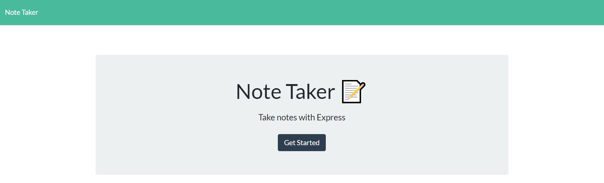
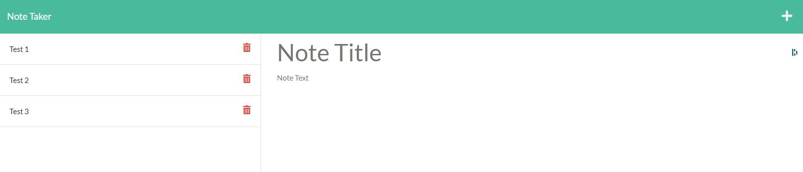

  # Note-Taker

  ## **Description**
  An application that uses an Express.js back end that will save and retrieve note data from a JSON file.

  ## **Images**
  
  
  
  ## **Table of Contents**
  
  * [Installation](#dependencies)
  * [Usage](#usage)
  * [Credits](#credits)
  * [License](#license)
  * [Features](#features)
  * [Languages](#languages)
  * [Technology](#technology)
  * [Tests](#tests)
  * [Contribute](#contribute)
  
  ## **Installation**
  npm i, npm i inquirer, npm i jest

  ## **Usage**
  Go to deployed application on Heroku (https://fathomless-lowlands-73551.herokuapp.com/) and add notes as you need them

  ## **Credits**
  

  ## **License**
  
   
  
   

  ## **Features**
  

  ## **Languages**
   CSS, HTML, JavaScript

  ## **Technology**
  https://expressjs.com/

  ## **Tests**
  In the terminal, type: npm test

  ## **Contribute**
  Find me on [GitHub](https://www.github.com/mattbisbee)
   
  Send me an [Email](mailto:aldhelm7@gmail.com)
   
  [Contributor Covenant](https://www.contributor-covenant.org/)